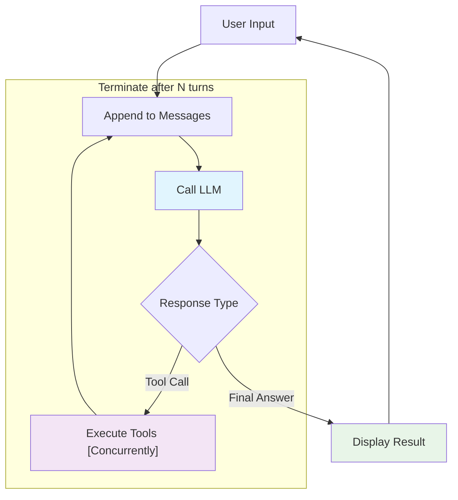

# z007 Architecture: Understanding AI Agents Through Simplicity

*pronounced: "zee-double-oh-seven"*

Most AI agent frameworks today—LangChain, Semantic Kernel, and AutoGen—offer comprehensive toolkits packed with extensive abstractions. While undeniably powerful, these frameworks can obscure the fundamental mechanics of how agents actually work.

z007 takes a deliberately different approach and demonstrates that effective AI agents operate on surprisingly simple principles. In just about 600 lines of code, z007 reveals the elegant simplicity at the heart of autonomous agents, making these concepts transparent and easy to understand.

## The Core Philosophy

By removing abstractions, we can see clearly how AI agents actually function. This transparency serves multiple purposes: it makes debugging straightforward, customization trivial, and provides the foundational understanding needed to work effectively with any agent framework.

## How z007 Works: The Agent Loop

At its core, z007 operates through a simple but powerful loop that mirrors how humans approach complex problems—we gather information, think about it, take action if needed, then repeat until we reach a solution.

```
User Input → Process with LLM → Execute Tools (if needed) → Repeat until Complete → Final Answer
```

Or more graphically: 



This loop captures the essence of autonomous behavior. The agent receives input, processes it using a language model, executes any necessary tools, and continues this cycle until it can provide a complete response. The simplicity is deceptive—this basic pattern enables sophisticated multi-step reasoning and complex task completion.

### Memory: Building Context Through Conversation

The agent's "memory" system demonstrates another area where simplicity is surprising effective: a growing list of messages captures the entire conversation history.

```python
messages = []
messages.append({"role": "system", "content": [{"text": system_prompt}]})
messages.append({"role": "user", "content": [{"text": prompt}]})
```

Each conversation turn appends new messages to this list, building the context that enables coherent multi-turn interactions. This approach scales surprisingly well for most use cases while remaining completely transparent. It also makes it simple to freeze the session and resume it at different time or at different compute node.

### Tools: Plain Functions and MPC(s)

z007's tool system showcases how agents bridge the gap between language understanding and real-world action. The `ToolRegistry` serves as a translator, converting both local Python functions and local MCP (Model Control Protocol) servers into agent-callable tools.

The conversion process is straightforward. Take a simple Python function:

```python
def calculator_tool(expression: str) -> str:
    """Performs mathematical calculations"""
    return str(eval(expression))
```

The `ToolRegistry` automatically introspects the function name, parameters, docstring, and type hints to create a tool specification that the language model can understand and use. This same process works identically for remote MCP tools, treating them as collections of callable functions accessed via JSON-RPC.

This design handles one of the most complex aspects of agent architecture—enabling AI models to interact with external systems—through a unified, simple interface.

## Multi-Step Reasoning

z007 also makes multi-step reasoning straightforward: it emerges naturally from the conversation loop. When faced with complex tasks, the agent doesn't need special planning algorithms or reasoning chains—it simply continues the conversation until LLM considers that the problem is solved.

```python
async def run_conversation(self, prompt: str) -> list[Any]:
    messages = [...]  # Initialize with system prompt and user message
    for turn in range(self.max_turns):
        response = await self.call_llm(messages, tool_config)
        if response['stopReason'] == 'tool_use':
            # Execute tools, add results to messages, continue
        else:
            break  # Final answer provided
    return responses
```

Consider a user asking: "What is 15 * 23, and then multiply that result by 2?" The agent/LLM naturally breaks this into steps:

1. **Turn 1**: Recognizes it needs to calculate 15 * 23, calls the calculator tool, receives "345"
2. **Turn 2**: Uses the previous result to calculate 345 * 2, receives "690"  
3. **Turn 3**: Provides the complete answer with clear explanation

Each turn builds on previous context, creating sophisticated reasoning behavior through simple iteration. The `max_turns` parameter provides a safety net, preventing infinite loops while allowing sufficient complexity for real-world tasks.

## Universal Compatibility: One Interface, Many Providers

z007's architecture accommodates couple LLM providers. Whether you're using AWS Bedrock, OpenAI's API, local models through LM Studio, or Ollama, the core agent logic remains unchanged and can be used with demo CLI interface:

```bash
# AWS Bedrock
AWS_PROFILE=<your profile> uvx z007@latest

# Local LM Studio
uvx z007@latest --provider openai --base-url http://localhost:1234/v1

# Ollama
uvx z007@latest --provider openai --base-url http://localhost:11434/v1 --model gpt-oss:20b
```

This flexibility ensures that z007 can adapt to different deployment scenarios without architectural changes, from cloud-based solutions to offline environments. A full fledged adapters for different provides are much more complex and if you need now check out [liteLLM](https://www.litellm.ai/)

## What z007 Reveals About Agent Architecture

By stripping away abstractions, z007 illuminates several key insights about how AI agents actually work:

**Conversation is Memory**: The most effective agent memory isn't a separate system—it's the conversation itself. Each message builds context that enables increasingly sophisticated interactions.

**Tools Bridge Worlds**: The gap between language understanding and real-world action is bridged through simple function calling interfaces. Complex integrations become manageable when viewed as collections of callable functions.

**Reasoning Emerges from Iteration**: Multi-step reasoning doesn't require specialized algorithms—it naturally emerges from continuing the conversation until completion and leverages advanced reasoning from LLMs itself.

**Simplicity Enables Transparency**: When you can see exactly how something works, debugging becomes straightforward, customization becomes trivial, and optimization becomes targeted.

## The Trade-offs: What z007 Doesn't Do

While z007 effectively illustrates fundamental agent principles, it intentionally omits several critical aspects to maintain clarity. These fall into two categories: features that would be part of a production agentic system, and infrastructure concerns for deployment.

**Simplified or Missing Agent Features:**
- Sophisticated error handling and recovery strategies
- Structured output validation and multi-modal responses  
- Advanced patterns like multi-agent coordination and long-term memory systems
- Complex/prescribed planning and adaptive learning capabilities

**Production Infrastructure Concerns:**
- Authentication and security measures
- Rate limiting and resource management
- Monitoring, logging, and observability
- Horizontal scaling and high availability
- Compliance and audit requirements

These omissions are deliberate—z007's purpose is educational clarity. Understanding these fundamentals provides the foundation for evaluating and working with more comprehensive frameworks.

## z007 as Learning Tool and Development Baseline

z007's transparent architecture serves two key purposes: as an educational foundation for understanding agent frameworks, and as a practical baseline for custom development.

With z007's clear 600-line implementation, you can trace through every decision and understand exactly how agent behavior emerges. This knowledge becomes invaluable when evaluating other frameworks—you'll recognize familiar patterns beneath their abstractions and make informed decisions about when complexity is justified.

For custom development, z007 provides a starting point that you can extend in targeted directions. Need authentication? Extend the HTTP layer. Want persistent memory? Add the message storage. Starting from a working foundation can be more effective than adapting complex frameworks to specific requirements.

## and in Conclusion

z007 shows that effective AI agents operate on surprisingly simple principles: accumulated message history, structured tool calls, and iterative reasoning loops. This simplicity isn't a limitation—it's a strength that provides transparency, enables customization, minimizes overhead, and facilitates learning. Once you grasp these fundamentals, you gain the confidence to debug, optimize, and extend agents regardless of which framework you ultimately choose.
