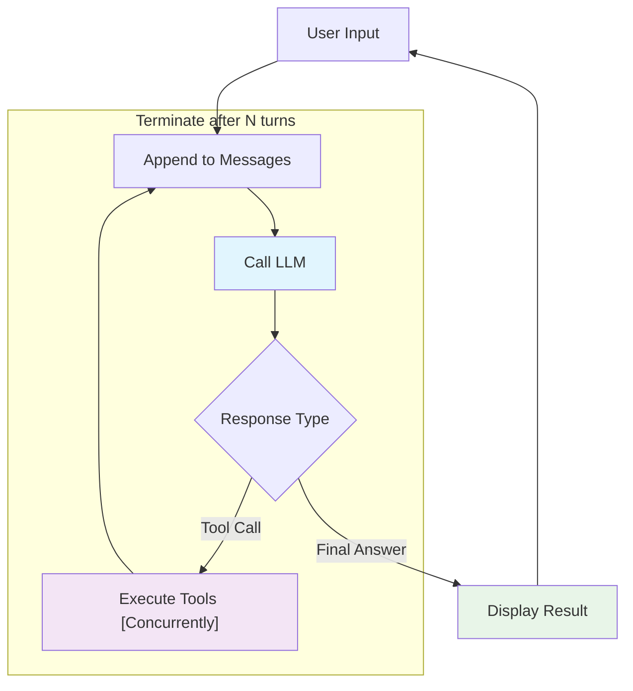

# ⚡ **z007** 🤖: A Nimble AI Agent

_pronounced: "zee-double-oh-seven"_

## Overview

Most AI agent frameworks like LangChain, Semantic Kernel, and AutoGen offer comprehensive toolkits with extensive abstractions. While powerful, these frameworks can hide the fundamental mechanics of how agents actually work. **z007** takes a different approach—it's a simple yet surprisingly capable agent that makes these core concepts transparent and easy to understand.

**z007** demonstrates in about 600 lines of code that effective AI agents are built on surprisingly simple principles:

1. **Conversations and memory are just lists of messages**
2. **Tools and MCP are collections of callable functions**  
3. **Function results get appended to the message list**
4. **The LLM processes everything and decides what to do next**
5. **The agent workflow is simply repeating this cycle until done**

**z007** uses AWS Bedrock **or** generic OpenAI API over HTTP, making it compatible with various LLM providers—both local and remote.

## Demo


## Quick Start

### Using AWS
```bash
AWS_PROFILE=<your profile> uvx z007@latest
```

### Using Local Model
```bash
uvx z007@latest --provider openai --base-url http://localhost:1234/v1
```

## Core Architecture

### The Agent Loop



The agent operates in a simple loop: receive input, process with the LLM, execute any needed tools, and repeat until the task is complete.

### Message-Based State Management

The agent's "memory" is straightforward—it's just a growing list of messages that captures the entire conversation history:

```python
messages = []
messages.append({"role": "system", "content": [{"text": system_prompt}]}) # AWS Bedrock format
messages.append({"role": "user", "content": [{"text": prompt}]})
```

For AWS Bedrock, system prompts are handled slightly differently:
```python
# AWS Bedrock system prompt format
if self.system_prompt:
    converse_params["system"] = [{"text": self.system_prompt}]
```

Each conversation turn adds new messages to this list, building the context that enables coherent multi-turn interactions.

### Tool Management: One Interface for Everything

The `ToolRegistry` provides a unified way to handle both local Python functions and external MCP (Model Control Protocol) services:

```python
class ToolRegistry:
    def __init__(self) -> None:
        self.tools: dict[str, Callable] = {}  # Local functions
        self.mcp_servers: dict[str, subprocess.Popen] = {}  # External processes
        self.mcp_tools: dict[str, str] = {}  # Tool → server mapping
```

This design treats MCPs as collections of remotely-callable functions, accessed via JSON-RPC but used identically to local tools.

### How Tools Work

Converting a Python function into an AI-callable tool is automatic. The system uses introspection to examine function names, parameters, docstrings, and type hints:

```python
def calculator_tool(expression: str) -> str:
    """Performs mathematical calculations"""
    return str(eval(expression))
```

The registry automatically converts this into the LLM's expected tool specification:
```python
{
    "toolSpec": {
        "name": "calculator_tool",
        "description": "Performs mathematical calculations", 
        "inputSchema": {"json": {"type": "object", "properties": {...}}}
    }
}
```

### Tool Execution Flow

Here's how tools get called and used:

1. **LLM decides it needs a tool** → returns `tool_use` stop reason
   - *Why this happens*: The LLM recognizes it needs external data or computation beyond its training knowledge

2. **Agent extracts tool calls** from the LLM's response
   - *Why this step*: Parse the structured tool requests to identify which functions to call with what parameters

3. **ToolRegistry executes tools concurrently** using structured concurrency  
   - *Why concurrent*: Multiple independent tools can run in parallel for better performance

4. **Agent adds results back** to the conversation as user messages
   - *Why as user messages*: Tool outputs become part of the conversation history, allowing the LLM to reason about the results

## The Conversation Loop

Multi-step reasoning happens through iterative conversation turns:

```python
async def run_conversation(self, prompt: str) -> list[Any]:
    messages = [...]  # Initialize with system prompt and user message
    
    for turn in range(self.max_turns):  # Prevent infinite loops
        response = await self.call_llm(messages, tool_config)
        
        if response['stopReason'] == 'tool_use':
            # Execute tools, add results to messages, continue
        else:
            break  # Final answer provided
    
    return responses
```

The `max_turns` parameter provides a safety net—too few turns limit complex reasoning capabilities, while too many risk infinite loops.

## Complete Example: Multi-Step Calculation

Let's trace through a complete interaction to see how everything works together.

**User asks**: "What is 15 * 23, and then multiply that result by 2?"

**Turn 1**: LLM calls calculator → `calculator_tool("15 * 23")` → returns "345"  
**Turn 2**: LLM calls calculator → `calculator_tool("345 * 2")` → returns "690"  
**Turn 3**: LLM provides final answer → "First, 15 * 23 = 345. Then, 345 * 2 = 690. So the final answer is 690."

**Final message history**:
```python
[
    {"role": "user", "content": [{"text": "What is 15 * 23, and then multiply that result by 2?"}]},
    {"role": "assistant", "content": [{"toolUse": {...}}]},  # First calculation
    {"role": "user", "content": [{"toolResult": {...}}]},   # Result: "345"
    {"role": "assistant", "content": [{"toolUse": {...}}]},  # Second calculation  
    {"role": "user", "content": [{"toolResult": {...}}]},   # Result: "690"
    {"role": "assistant", "content": [{"text": "First, 15 * 23 = 345..."}]}
]
```

This shows how message accumulation enables multi-step reasoning—each step builds on previous results.

## Choosing the Right Tool

### When Comprehensive Frameworks Make Sense

| Framework | Ideal Use Case | What You Trade |
|-----------|---------------|----------------|
| **LangChain** | Need broad functionality and rapid prototyping | Complex abstractions can make debugging difficult |
| **AutoGen** | Multi-agent conversations with role-based interactions | Complex message routing and lifecycle management |
| **Semantic Kernel** | Enterprise integration, especially Microsoft ecosystem | Steep learning curve and heavy configuration overhead |

### When z007's Simplicity Wins

**Transparency**: You can see exactly how the agent works without digging through framework abstractions

**Customization**: Easy to modify core behavior without fighting framework assumptions or conventions

**Performance**: Minimal overhead with direct control over async execution patterns and resource usage

**Learning**: Perfect for understanding the fundamental concepts before moving to more complex frameworks

## Key Takeaways

**z007** proves that effective AI agents operate on surprisingly simple principles: accumulated message history, structured tool calls, and iterative reasoning loops. Understanding these fundamentals gives you the confidence to debug, optimize, and extend agents regardless of which framework you ultimately choose.

The magic isn't in complex abstractions—it's in the elegant simplicity of how conversations, tools, and reasoning cycles work together.